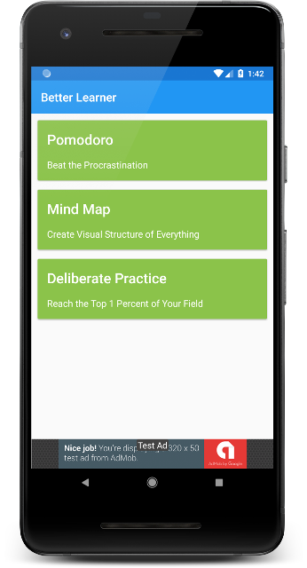
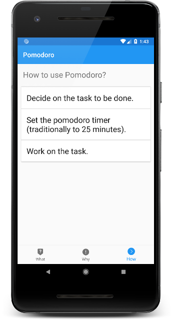

### :small_blue_diamond: Project Year: 2018 :small_blue_diamond:
#### (Udacity Android Developer Nanodegree Project 6 and 7)
# Better Learner: Android App for Effective Learning
### An app to help anyone who want to improve their learning process in short time. It will provide the techniques which can be used to learn faster and master the material.
---

* Technologies: Java, XML, Firebase
* Platform Features: Widgets, Admob, AsyncTaskLoader, RecyclerView, CardView, BottomNavigationView
* Libraries: Android Support, Moshi, OkHttp, Gson, Firebase
* Tools and OS : Android Studio, Ubuntu
* Platform: Android 4.1+
* Modules: Techniques, Technique Detail
* Lines of Code:  2500
* Duration: 1 Week (FEB 2018)

### Screenshots

